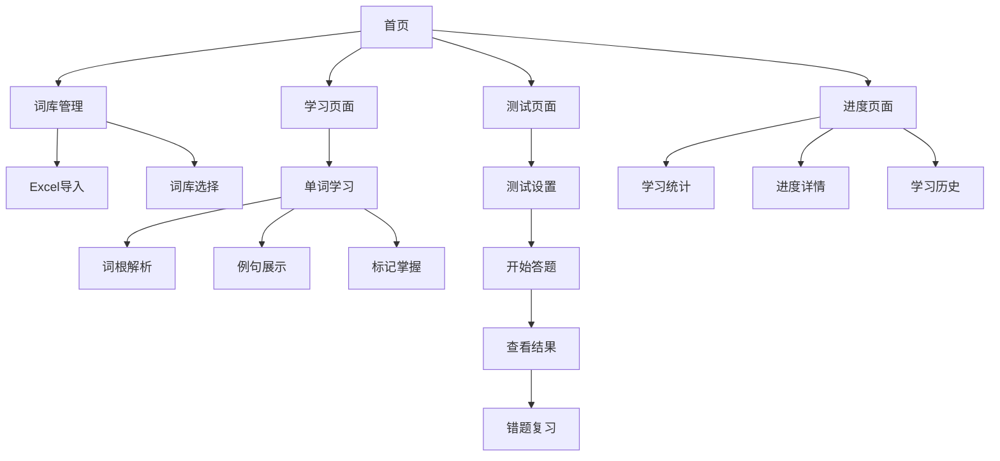

## 1. 产品概述
一个功能完整的英语单词学习React应用，帮助用户高效学习英语词汇。通过词根词缀解析、例句展示和个性化测试，提升用户的词汇掌握能力。

面向英语学习者，特别是需要系统提升词汇量的学生和职场人士，提供科学的学习方法和进度跟踪。

## 2. 核心功能

### 2.1 用户角色
| 角色 | 注册方式 | 核心权限 |
|------|----------|----------|
| 普通用户 | 邮箱注册 | 导入词库、学习单词、参与测试、查看进度 |

### 2.2 功能模块
本应用包含以下主要页面：
1. **首页**：学习概览、快速开始、导航菜单
2. **词库管理页**：Excel文件导入、词库列表、词汇编辑
3. **学习页面**：单词详情、词根词缀解析、例句展示
4. **测试页面**：自定义测试、答题界面、结果反馈
5. **进度页面**：学习统计、掌握程度、学习记录

### 2.3 页面详情
| 页面名称 | 模块名称 | 功能描述 |
|----------|----------|----------|
| 首页 | 学习概览 | 显示今日学习单词数、累计学习天数、掌握词汇量 |
| 首页 | 快速开始 | 提供开始学习、继续学习、开始测试三个快捷入口 |
| 首页 | 导航菜单 | 底部导航栏包含首页、学习、测试、进度四个标签 |
| 词库管理页 | Excel导入 | 支持拖拽或点击上传Excel文件，自动解析单词数据 |
| 词库管理页 | 词库列表 | 显示所有词库，包含词汇数量、创建时间、学习进度 |
| 词库管理页 | 词汇编辑 | 支持添加、编辑、删除单个单词及其释义 |
| 学习页面 | 单词详情 | 显示单词拼写、音标、中文释义、词性 |
| 学习页面 | 词根词缀解析 | 自动分析单词的词根、前缀、后缀，帮助记忆 |
| 学习页面 | 例句展示 | 提供中英文对照的例句，支持语音朗读 |
| 学习页面 | 学习操作 | 标记已掌握、加入收藏、查看下一个单词 |
| 测试页面 | 自定义测试 | 设置测试词汇量（10-50个）、选择测试词库、测试模式 |
| 测试页面 | 答题界面 | 显示题目、选项选择、提交答案、显示对错 |
| 测试页面 | 结果反馈 | 显示得分、正确率、错题回顾、重新测试 |
| 进度页面 | 学习统计 | 折线图展示学习趋势、柱状图显示各词库进度 |
| 进度页面 | 掌握程度 | 按掌握状态分类显示词汇（未学习/学习中/已掌握） |
| 进度页面 | 学习记录 | 时间轴形式展示每日学习详情 |

## 3. 核心流程

### 用户学习流程
用户首次使用应用时，需要先导入词库或选择系统词库。然后可以开始学习单词，系统会按照记忆曲线推荐学习内容。学习过程中可以查看词根词缀解析和例句。完成一定数量单词后，可以进行测试检验学习效果。系统会记录学习进度，生成统计数据帮助用户了解学习情况。

## 4. 用户界面设计

### 4.1 设计风格
- **主色调**：深蓝色（#2563eb）配白色背景，营造专业学习氛围
- **辅助色**：绿色（#10b981）表示正确，红色（#ef4444）表示错误
- **按钮样式**：圆角矩形，悬停效果明显，主按钮使用主色调
- **字体**：中文使用思源黑体，英文使用Inter，标题18-24px，正文14-16px
- **布局风格**：卡片式布局，信息层次清晰，留白充足
- **图标风格**：使用简洁的线性图标，统一使用2px线宽

### 4.2 页面设计概览
| 页面名称 | 模块名称 | UI元素 |
|----------|----------|--------|
| 首页 | 学习概览 | 顶部统计卡片，使用渐变背景和数字动画效果 |
| 首页 | 快速开始 | 三个大按钮横向排列，图标+文字，悬停放大效果 |
| 词库管理页 | Excel导入 | 拖拽区域使用虚线边框，上传进度条显示 |
| 词库管理页 | 词库列表 | 卡片列表展示，每张卡片包含标题、数量、进度条 |
| 学习页面 | 单词详情 | 中央大卡片显示，单词拼写使用36px大字体 |
| 学习页面 | 词根词缀解析 | 使用树状图或分段高亮显示词根、前缀、后缀 |
| 测试页面 | 答题界面 | 题目居中显示，选项使用大按钮，点击变色反馈 |
| 进度页面 | 学习统计 | 使用Chart.js图表，折线图和柱状图组合展示 |

### 4.3 响应式设计
采用桌面端优先的设计方案，确保在1920x1080分辨率下有最佳体验。同时适配平板（768px以上）和手机（375px以上）设备，通过媒体查询调整布局和字体大小。触摸交互优化包括增大点击区域、添加触摸反馈动画等。