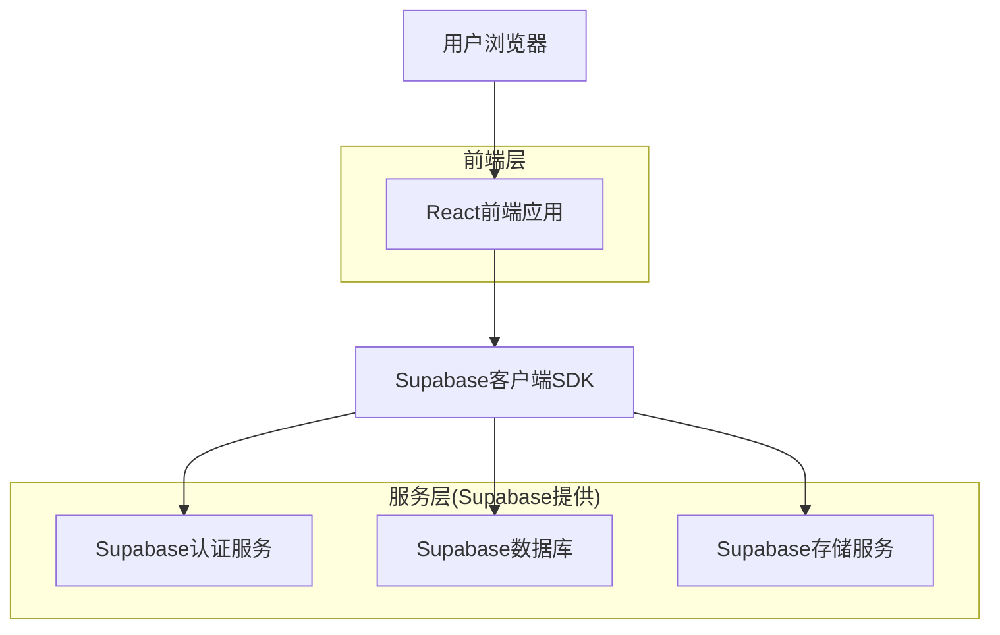
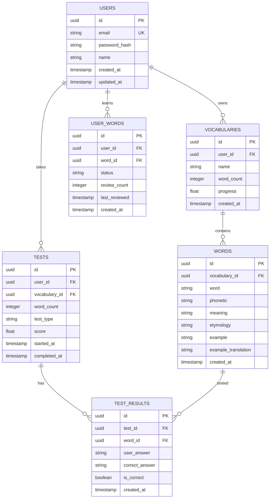

## 1. 架构设计



## 2. 技术描述

- **前端**：React@18 + TypeScript@5 + TailwindCSS@3 + Vite
- **初始化工具**：vite-init
- **后端**：Supabase (BaaS)
- **UI组件库**：Ant Design@5
- **图表库**：Chart.js@4
- **Excel处理**：xlsx@0.18
- **状态管理**：React Context + useReducer

## 3. 路由定义

| 路由 | 用途 |
|------|------|
| / | 首页，显示学习概览和快速入口 |
| /vocabulary | 词库管理页面，管理单词库和导入功能 |
| /learn | 学习页面，显示单词详情和学习功能 |
| /test | 测试页面，进行词汇量测试 |
| /progress | 进度页面，查看学习统计和进度 |
| /login | 登录页面，用户身份验证 |
| /register | 注册页面，新用户注册 |

## 4. API定义

### 4.1 认证相关API

```
POST /auth/signup
```

请求：
| 参数名 | 参数类型 | 是否必需 | 描述 |
|--------|----------|----------|------|
| email | string | 是 | 用户邮箱 |
| password | string | 是 | 用户密码 |

响应：
| 参数名 | 参数类型 | 描述 |
|--------|----------|------|
| user | object | 用户信息 |
| session | object | 会话信息 |

```
POST /auth/signin
```

请求：
| 参数名 | 参数类型 | 是否必需 | 描述 |
|--------|----------|----------|------|
| email | string | 是 | 用户邮箱 |
| password | string | 是 | 用户密码 |

### 4.2 词汇相关API

```
GET /api/vocabularies
```

获取用户的词汇库列表

响应：
```json
{
  "data": [
    {
      "id": "uuid",
      "name": "CET-4词汇",
      "word_count": 4500,
      "progress": 0.35,
      "created_at": "2024-01-01"
    }
  ]
}
```

```
POST /api/vocabularies/import
```

导入Excel文件

请求：
| 参数名 | 参数类型 | 是否必需 | 描述 |
|--------|----------|----------|------|
| file | File | 是 | Excel文件 |
| vocabulary_name | string | 是 | 词库名称 |

### 4.3 学习相关API

```
GET /api/words/learn
```

获取待学习的单词

请求参数：
| 参数名 | 参数类型 | 是否必需 | 描述 |
|--------|----------|----------|------|
| vocabulary_id | string | 是 | 词库ID |
| count | number | 否 | 获取数量，默认10个 |

```
POST /api/words/progress
```

更新单词学习进度

请求：
| 参数名 | 参数类型 | 是否必需 | 描述 |
|--------|----------|----------|------|
| word_id | string | 是 | 单词ID |
| status | string | 是 | 学习状态（learning/mastered） |

### 4.4 测试相关API

```
POST /api/tests/start
```

开始测试

请求：
| 参数名 | 参数类型 | 是否必需 | 描述 |
|--------|----------|----------|------|
| vocabulary_id | string | 是 | 词库ID |
| word_count | number | 是 | 测试单词数量 |
| test_type | string | 是 | 测试类型（choice/fill） |

```
POST /api/tests/submit
```

提交测试答案

请求：
| 参数名 | 参数类型 | 是否必需 | 描述 |
|--------|----------|----------|------|
| test_id | string | 是 | 测试ID |
| answers | array | 是 | 答案数组 |

## 5. 数据模型

### 5.1 数据模型定义



### 5.2 数据定义语言

用户表 (users)
```sql
-- 创建用户表
CREATE TABLE users (
    id UUID PRIMARY KEY DEFAULT gen_random_uuid(),
    email VARCHAR(255) UNIQUE NOT NULL,
    password_hash VARCHAR(255) NOT NULL,
    name VARCHAR(100) NOT NULL,
    created_at TIMESTAMP WITH TIME ZONE DEFAULT NOW(),
    updated_at TIMESTAMP WITH TIME ZONE DEFAULT NOW()
);

-- 创建索引
CREATE INDEX idx_users_email ON users(email);
```

词库表 (vocabularies)
```sql
-- 创建词库表
CREATE TABLE vocabularies (
    id UUID PRIMARY KEY DEFAULT gen_random_uuid(),
    user_id UUID REFERENCES users(id) ON DELETE CASCADE,
    name VARCHAR(255) NOT NULL,
    word_count INTEGER DEFAULT 0,
    progress FLOAT DEFAULT 0,
    created_at TIMESTAMP WITH TIME ZONE DEFAULT NOW()
);

-- 创建索引
CREATE INDEX idx_vocabularies_user_id ON vocabularies(user_id);
```

单词表 (words)
```sql
-- 创建单词表
CREATE TABLE words (
    id UUID PRIMARY KEY DEFAULT gen_random_uuid(),
    vocabulary_id UUID REFERENCES vocabularies(id) ON DELETE CASCADE,
    word VARCHAR(100) NOT NULL,
    phonetic VARCHAR(100),
    meaning TEXT NOT NULL,
    etymology TEXT,
    example TEXT,
    example_translation TEXT,
    created_at TIMESTAMP WITH TIME ZONE DEFAULT NOW()
);

-- 创建索引
CREATE INDEX idx_words_vocabulary_id ON words(vocabulary_id);
CREATE INDEX idx_words_word ON words(word);
```

用户单词关联表 (user_words)
```sql
-- 创建用户单词关联表
CREATE TABLE user_words (
    id UUID PRIMARY KEY DEFAULT gen_random_uuid(),
    user_id UUID REFERENCES users(id) ON DELETE CASCADE,
    word_id UUID REFERENCES words(id) ON DELETE CASCADE,
    status VARCHAR(20) DEFAULT 'learning' CHECK (status IN ('learning', 'mastered')),
    review_count INTEGER DEFAULT 0,
    last_reviewed TIMESTAMP WITH TIME ZONE,
    created_at TIMESTAMP WITH TIME ZONE DEFAULT NOW(),
    UNIQUE(user_id, word_id)
);

-- 创建索引
CREATE INDEX idx_user_words_user_id ON user_words(user_id);
CREATE INDEX idx_user_words_word_id ON user_words(word_id);
CREATE INDEX idx_user_words_status ON user_words(status);
```

测试表 (tests)
```sql
-- 创建测试表
CREATE TABLE tests (
    id UUID PRIMARY KEY DEFAULT gen_random_uuid(),
    user_id UUID REFERENCES users(id) ON DELETE CASCADE,
    vocabulary_id UUID REFERENCES vocabularies(id) ON DELETE CASCADE,
    word_count INTEGER NOT NULL,
    test_type VARCHAR(20) NOT NULL CHECK (test_type IN ('choice', 'fill')),
    score FLOAT,
    started_at TIMESTAMP WITH TIME ZONE DEFAULT NOW(),
    completed_at TIMESTAMP WITH TIME ZONE
);

-- 创建索引
CREATE INDEX idx_tests_user_id ON tests(user_id);
CREATE INDEX idx_tests_vocabulary_id ON tests(vocabulary_id);
```

测试结果表 (test_results)
```sql
-- 创建测试结果表
CREATE TABLE test_results (
    id UUID PRIMARY KEY DEFAULT gen_random_uuid(),
    test_id UUID REFERENCES tests(id) ON DELETE CASCADE,
    word_id UUID REFERENCES words(id) ON DELETE CASCADE,
    user_answer VARCHAR(255),
    correct_answer VARCHAR(255) NOT NULL,
    is_correct BOOLEAN NOT NULL,
    created_at TIMESTAMP WITH TIME ZONE DEFAULT NOW()
);

-- 创建索引
CREATE INDEX idx_test_results_test_id ON test_results(test_id);
CREATE INDEX idx_test_results_word_id ON test_results(word_id);
```

### 5.3 Supabase访问权限设置

```sql
-- 基本访问权限
GRANT SELECT ON users TO anon;
GRANT SELECT ON vocabularies TO anon;
GRANT SELECT ON words TO anon;

-- 认证用户完整权限
GRANT ALL PRIVILEGES ON users TO authenticated;
GRANT ALL PRIVILEGES ON vocabularies TO authenticated;
GRANT ALL PRIVILEGES ON words TO authenticated;
GRANT ALL PRIVILEGES ON user_words TO authenticated;
GRANT ALL PRIVILEGES ON tests TO authenticated;
GRANT ALL PRIVILEGES ON test_results TO authenticated;
```

### 5.4 RLS(行级安全)策略

```sql
-- vocabularies表的RLS策略
ALTER TABLE vocabularies ENABLE ROW LEVEL SECURITY;

CREATE POLICY "用户只能查看自己的词库" ON vocabularies
    FOR SELECT USING (auth.uid() = user_id);

CREATE POLICY "用户只能修改自己的词库" ON vocabularies
    FOR ALL USING (auth.uid() = user_id);

-- words表的RLS策略  
ALTER TABLE words ENABLE ROW LEVEL SECURITY;

CREATE POLICY "用户可以查看词库中的单词" ON words
    FOR SELECT USING (
        vocabulary_id IN (
            SELECT id FROM vocabularies WHERE user_id = auth.uid()
        )
    );

-- user_words表的RLS策略
ALTER TABLE user_words ENABLE ROW LEVEL SECURITY;

CREATE POLICY "用户只能查看自己的学习记录" ON user_words
    FOR ALL USING (auth.uid() = user_id);
```